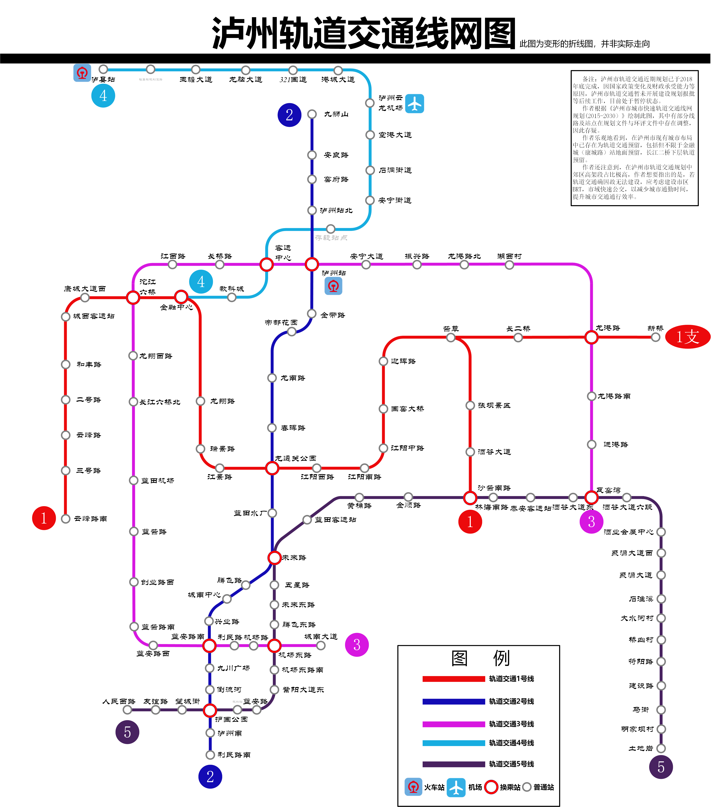

# 泸州市轨道交通近期规划/泸州地铁规划

泸州市轨道交通近期规划已于 *2018年底* 完成，因国家政策变化及财政承受能力等原因，泸州市轨道交通暂未开展建设规划报批等后续工作，目前处于暂停状态。

作者根据 **《泸州市城市快速轨道交通线网规划(2015-2030）》** 绘制此图，其中有部分线路及站点在规划文件与环评文件中存在调整，因此存疑。

作者乐观地看到，在泸州市现有城市布局中已存在为轨道交通预留，**包括但不限于**金融城（康城路）站地面预留，长江二桥下层轨道预留。

作者还注意到，在泸州市轨道交通规划中郊区高架段占比极高，作者想要指出的是，若轨道交通确因故无法建设，应考虑建设**市区BRT，市域快速公交**，以减少城市通勤时间，提升城市交通通行效率。

